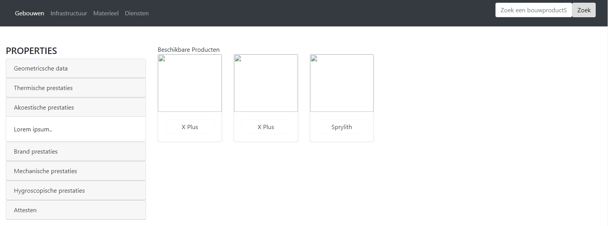
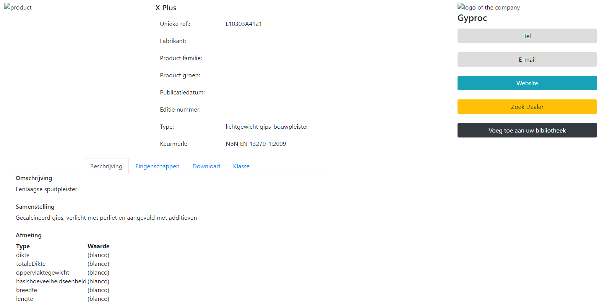

# Neo4j Products Application - `neo4j-driver` Edition

* Based on [Neo4j Movies Example Application](https://github.com/neo4j-examples/movies-javascript-bolt)





## Stack

* [Neo4j Bolt JavaScript Driver](https://github.com/neo4j/neo4j-javascript-driver)
* Neo4j
* Frontend: ES6, jquery, bootstrap 4, [d3.js](http://d3js.org/)
* Webpack for building web assets


## Quickstart - user mode

* Start Neo4j ([Download & Install](http://neo4j.com/download)) locally or online with grapheneDB, open the [Neo4j Browser](http://localhost:7474) and run the database.
* Clone this project from GitHub.
* Check in the file "front/src/neo4jApi.js" that the correct database is uncommented, if not:
  - Uncommente it (delete //) or add you database with its URL, your username and password,
  - Comment the line(s) for the other database (add //),
  - Run :
  ```bash
  $ npm run build
  ```
* Open the local file "front/build/index.html".

## Quickstart - developer mode

### Setup

```bash
$ npm install
```

### Run locally

* Start Neo4j ([Download & Install](http://neo4j.com/download)) locally, open the [Neo4j Browser](http://localhost:7474) and run the database.
* Clone this project from GitHub.
* Run the App inside the Webpack Dev Server:

```bash
# run in developement mode (refreshes the app on source code changes)
$ npm run dev

# builds the release version with client assets in "build" directory
$ npm run build
```

(When running in "dev" mode navigate to [http://localhost:8080/webpack-dev-server/](http://localhost:8080/webpack-dev-server/) to see the application.)

After executing the `npm run build` command,  open local file "build/index.html" in your browser. (you just have to open this file to access tha web-app)


# Web service for productDB

You can access to the data hosted on GrapheneDB throw HTTP requests.
The link of the app deployed on Heroku is the following : https://fast-shelf-85138.herokuapp.com

It has been deployed on a free version of Heroku, don't worry if it is a bit long to answer.

## To make the request you can use:
* Your web-browser: copying the link in the address bar
* Postman: making a _"GET"_ request
* Linux Bash: using the command _"curl"_

## The usages are:
* _URL_
* _URL_/subject : display 20 products
* _URL_/subject/search : display the name of the research method for each property
* _URL_/subject/search/findBy_PropertyName_?name=_yourInput_ : display the products that have _yourInput_ as value for the attibute _propertyName_.
